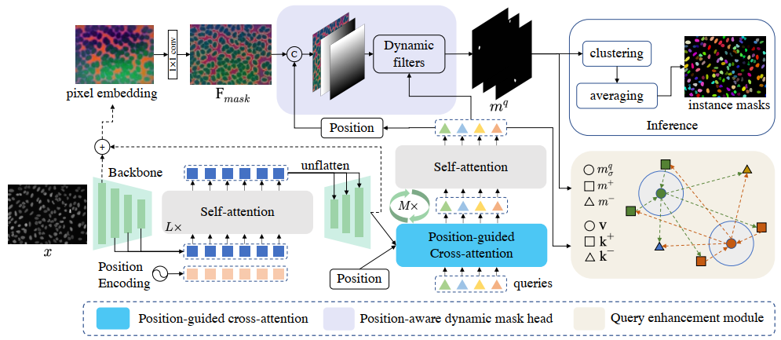

## PCTrans: Position-Guided Transformer with Query Contrast for Biological Instance Segmentation (ICCVW 2023)

PCTrans is the first one-stage position-guided transformer with query contrast for biological instance segmentation.



## Paper
This repository provides the official implementation of PCTrans.

<b>PCTrans: Position-Guided Transformer with Query Contrast for Biological Instance Segmentation</b> <br/>
[Qi Chen](https://scholar.google.com/citations?user=4Q5gs2MAAAAJ&hl=en&scioq=Qi+Chen+ustc)<sup>1</sup>, [Wei Huang](https://scholar.google.com/citations?user=C4zmoy4AAAAJ&hl=en)<sup>1</sup>, [Xiaoyu Liu](https://scholar.google.com/citations?user=0qyOmX8AAAAJ&hl=en&oi=ao)<sup>1</sup>, [Jiacheng Li](http://home.ustc.edu.cn/~jclee/)<sup>1</sup>, [Zhiwei Xiong](http://staff.ustc.edu.cn/~zwxiong/)<sup>1</sup> <br/>
<sup>1 </sup>University of Science and Technology of China<br/>
paper | [code](https://github.com/qic999/PCTrans) | slides | poster 
<!-- [paper](https://link.springer.com/content/pdf/10.1007/978-3-031-16440-8_4.pdf) -->

## ⏳ Dataset Link
- [CVPPP](https://www.plant-phenotyping.org/datasets-download)
- [BBBC](https://bbbc.broadinstitute.org/BBBC039)

## ⏳ Command

```python
cd connectomics/model/maskformer_block/pixel_decoder/ops
sh make.sh
cd ../../../../..
```

Training:
```python
python -u -m torch.distributed.launch \
--nproc_per_node=4 --master_port=4321 scripts/main.py --distributed \
--config-base configs/CVPPP/CVPPP-PCTrans-Base.yaml \
--config-file configs/CVPPP/CVPPP-PCTrans.yaml
```
Inference:
```python
python -u scripts/eval.py \
--config-base configs/CVPPP/CVPPP-PCTrans-Base.yaml \
--config-file configs/CVPPP/CVPPP-PCTrans.yaml --name cvppp
```

## 💡 Acknowledgement
This project is built upon previous projects. Especially, we'd like to thank the contributors of the following github repositories:
- [Mask2Former](https://github.com/facebookresearch/Mask2Former)
- [pytorch_connectomics](https://github.com/zudi-lin/pytorch_connectomics)

## 🛡️ License
This project is under the CC-BY-NC 4.0 license. See [LICENSE](LICENSE) for details.

## 📦 Contact
qic@mail.ustc.edu.cn

<!-- ## 📦 Citation
If you find this work or code is helpful in your research, please cite:
```
@inproceedings{chen2022mask,
  title={Mask Rearranging Data Augmentation for 3D Mitochondria Segmentation},
  author={Chen, Qi and Li, Mingxing and Li, Jiacheng and Hu, Bo and Xiong, Zhiwei},
  booktitle={Medical Image Computing and Computer Assisted Intervention--MICCAI 2022: 25th International Conference, Singapore, September 18--22, 2022, Proceedings, Part IV},
  pages={36--46},
  year={2022},
  organization={Springer}
} -->